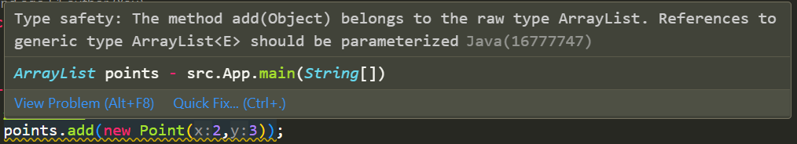

ctrl+shift+P for commmand palette
git: stash to stash changes from last commit (note it has to be in the same directory as the .git hidden files folder)
git: pop stash to return changes and remove from stash
stashes do not save changes to new/removed files?
yippee

# week 2
- if you print an object with no definition it will print the classname@hexnumber
- classes are things you make objects from
- java.lang.Object is also a class - Object() class constructs a new Object, has a bunch of methods on it. every object in Java is an instance of a class, and every class derives from the java.lang.Object class. therefore every method in java has the toString() method etc. as such, any object can be printed to console. default behaviour of toString() is class@hash.
- if you want to change the behaviour of an inherent method e.g. toString(), you should use the @Override thing to tell it we want to override it.
- the @Override method tells the compiler "i'm definitely changing the behaviour of an existing method" like a safety feature, just in case we mistype tostring() etc.
```
@Override
public String toString(){
    return "foo";
}
```

- constructors: only have to write the word once `Point3D(int x, int y, int z)`
- `this.x` refers to the attribute of the object, rather than the parameter of the constructor. though it could be smelly. maybe better to just use different parameter names.
- avoid repeating yourself
```
Point3D(int in){
    //x = in;
    //y = in;
    //z = in; 
    this(in, in, in);
}
```

- static variables are attributes that belong to a class. any object of that class will have the class's static variable, even if the object isn't instatiated. so even if you set a `static int w` to something for p4, it will also change it for p5.

 
- public is the default behaviour for everything in Java. so even if you write nothing in front of it, it will be public.
- if you change an attribute to private, then you won't be able to access it from outside the object/class itself, i.e. you need to use a method to modify that attribute. e.g. `Point3D.w = 27;` won't work anymore. making it private an only accessible using methods means that if we decide to change something like the data type (int to double), we only have to amend the method, rather than edit every single time we mention the attribute.

prac:
Canvas extends JPanel so has the paint(Graphics g) method. create a blank grid (which the constructor then makes an arraylist of cells) and call the grid's paint method. that takes each cell in the list and tells it to paint itself at its position.
getmousposition from canvas. returns a point2D (x,y). pass it all the way down to the cell when it's drawn, and check, is that point's position within the bounds of the cell? if so, then colour it.

# week 3 - class inheritance
- will always get the variable from the most local scope (if same name)
- instance scope, use `this` keyword
- `super` gets the inheritance scope
- dynamic binding - OOP languages make decisions of which methods to run at runtime if inheritance is involved (e.g. cat breathe() or mammal breathe())
- okay to call a method on a class's parent (e.g. mammal1.eat() but not animal1.breathe())
- @Override helps to say we are overriding an existing method on the parent class, to avoid typos and doubled methods
- can pass a reference variable and assign it to a variable of a higher type e.g. `Animal creature = new Cat();`
- however, cannot do the other way. but can typecast: `simon = (Cat) creature;` treat this thing as a subclass but only if it is this subclass
```
Animal creature;
Cat simon = new Cat();
creature = simon;
simon = (Cat) creature;
simon.eat();
```
- don't repeat yourself - avoid pulling code from the superclass...
- interfaces are another kind of inheritance - a way of listing behaviours/methods.
- i.e. methods (breathe, eat), not attributes (weight, age)
- e.g. `class Automobile implements Driveable` 
- if we create 2 classes that both implement the Driveable interface, we have a way of describing sets of behaviours thta apply tomultiple classes.
- only available through interfaces??
```
public interface Driveable {
    boolean startEngine();
    void stopEngine();
    float accelerate(float acc);
}
```
- by implementing an interface we are telling the complier to check these things are in the class and are the same types?
- calling the method of a Driveable d = automobile will call the method of the class.
- you can implement multiple interfaces in one class `class Automobile implements Driveable, Parkable` - need to have all th emethods defined in the Driveable interface defined in the class, plus the methods in the Parkable interface. must implement all methods to use that interface, but still okay to have extra methods unique to the class.
- no method body in interface method declaration
- can have inheritance as well as implement interfaces

- can also extend an interface
```
public interface Flyable extends Driveable {
    void fly();
}
```
`class Automobile implements Flyable` - gets methods fly() as well as Driveable methods


inner classes:
- sometimes you only need a class once/for the class that it's in, rather that creating a new class fiile
- can put the definition inside another class definition
```
Class Animal {
    Class Brain {
        ...
    }
}
```
- probably avoid using inner classes if you're unclear as to if you should use one

polymorphism:
- The most common use of polymorphism in OOP occurs when a parent class (`Animal`) reference `a` is used to refer to a child class (`Deer`) object `d`. 
- compile-time polymorphism - static polymorphism, multiple methods with the same name but different parameters - method overloading
- runtime polymorphism - dynamic method dispatch, implemented by method overriding
- An overridden method is essentially hidden in the parent class, and is not invoked unless the child class uses the super keyword within the overriding method.
- virtual method invocation - if a subclass has the same method defined as a parent method, and we say `Employee e = new Salaryman();` and call `e.getSalary();`, it will call `getSalary()` for the Employee class at compile time, but then at run time the JVM will run it for the Salaryman class. therefore, an overridden method is always invoked at runtime, no matter the data type of the reference

# week 4
ArrayLists:
- take Objects/wrapper classes, not types (Integer not int, Character not char) for every primitive type there is a wrapper class for it. except for arrays - ArrayLists
- in Java, String is a primitive type, but like a built in arraylist of chars
Generics:
- a class that takes another class as an argument e.g. `Class ArrayList<E>`
- class and method definitions that include parameters for types - allows to write code that applies to any class
- e.g. define a class for a list of items of type T, where T is a type parameter. then can pass a String class as type T, or an Integer class etc
- when inheriting a class, the new class takes attribute, constructors, and methods.
- if we have a class that is purely only to be inherited and built upon, never used by itself - e.g. generic Mammal, we can have specialised versions of it (Cat, Dog) but prevent from making an instance of the generic type. called an abstract class. `public abstract class MyClass`
- `Class AbstractCollection<E>` 
- a queue is a collection where there is ordering involved - set has no order - different kinds of collections.

- boxing and unboxing - automatically converitng between primitive and wrapper types ( constuctor parameters)
- to make generic, go to class definition and modify to take type variables. variables in place where we would typcially put types.
- `public class Pair <T, P>` (convention is single letters i.e. `<E>`) - the identifier E between the angle brackets is a type variable. indicates that the class Pair is generic and requires a Java type as an arguent to make it complete. the type variable may be used to declare instance variables, arguments to methods, the return type of methods. this avoids overloading methods like `public void add (String s)` where an arbitrary `Object` type can still be accepted by the class.
```
public class List< E > {
    ...
    public void add( E element ) {...}
    public E get( int i ) {...}
}
```
- note static methods cannot use the type variable
- now we can complete the `List` type by supplying any type parameter - called "instantiating the type" or "invoking the type"
`List<Date> dates;`
`List<java.math.BigDecimal> decimals;`
`List<Foo> foos;` etc

- everything in the system is an object - the angle brackets just add a constraint to the compilation process - once the type check is happy, the compiler is happy and forgets about it, so generates the same byte code in the end. thus, the following lines achieve essentially the same thing.
- "erasure" - since everything we do with generics applies statically at compile-time, generic info does not need to be carried over into the compiled classes. the generic nature of the classes enforced by the compiler can be "erased" in the compiled classes, allowing us to maintain compatibility with nongeneric code. Java runtime does not know anything about generics at all, although the compiler retains generic informations.
- generics are erased by the compiler for backwards compatibility.
- all the generic safety checking was done at compile time, so at runtime we cannot tell the difference between one incarnation of List and another. we are dealing with a single List type. List is the "raw type" of the generic class e.g. `List<Date>` and `List<String>` share the Java class List, with the type variables replaced with a general Java type like Object.
- how does the combination of static typing and erasure reduce the amount of polymorphism available in Java? the raw type of a generic class can be used to bypass the static type checks we would expect. at run time there is no way to get the checks back, because all the necessary type information has been erased.
```
ArrayList<Pair> p = new ArrayList<Pair>();
ArrayList q = new ArrayList();
```
- generic type inference - the compiler is smart enough to infer the type of the initialising expression from the type of the variable we are assigning to it, helps shorthand the right side of variable declarations by leaving out the contents of the `<>`
- `List` is an Interface, of which ArrayList implements. i.e. ArrayList implements the methods of the List Interface (add, remove, etc), which Sets, Queues, etc also have.
- if we decide we want to use a linked list instead of arraylist, rather than changing every line, we can use the List interface and just change the instantiation: `List x = new ArrayList();` -> `List x = new LinkedList();`
- however, we can place limitations or bounds on the parameter types, and the compiler can be more restrictive about the erasure of the type. can make something implement something from a class or below, or use an interface - but in Java, you use "extends" no matter whether it is an interface or superclass...? `public class List< E extends Date>` - the element type E must be a subtype of the `Date` type. therefore the method `public void addElement( Date element )` is therefore more restrictive than `Object` and the compiler uses `Date`. `Date` is called the "upper bound" of this type, meaning it is at the top of the object hierarchy here and the type can only be instantiated on type `Date` or on lower/more derived types.


- inheritance applies only to the "base" generic type, and not to the parameter types. assignability applies only when the two generic types are instantiated on exactly the same parameter type.
- e.g., recallling that a `List` is a type of `Collection`, we can assign instantiations of List to instantiations of Collection when the type parameter is EXACTLY the same:
```
Collection<Date> cd;
List<Date> ld = new ArrayList<Date>();
cd = ld; // Ok!
```
but:
```
List<Object> lo;
List<Date> ld = new ArrayList<Date>();
lo = ld; // Compile-time Error! Incompatible types.
```
- must be EXACTLY the same, so even trying to put `List<Integer>` into `Collection<Number>` will not work. inheritance does not follow parameter types.

generic methods:
- you can define a generic method that has its own type parameter that is not the type parameter of any class. this generic method can be a member of an ordinary class or some generic class with some other type parameter.
- e.g. even if a class has no type parameters, its methods can have a type parameter in angular brackets placed after the modifiers and before the return type.
`public <T> T getMidpoint(T[] a){...}`
- when invoking a method like this, preface the method name with the type to be plugged in, given in angular brackets: `String midString = MyClass.<String>getMidpoint(b);`
- can have different type parameters for the entire class (defined in the class definition) or for only the method (in method definition)

Practical:
- create a List of actors rather than ArrayList, in case in the the future we want to change it to a collection or set etc.

# week 5 - exceptions
excption handking in a try/catch block:
- code that might produce an error in the try block
- if somethong goes wrong, do the catch block
different kinds of exceptions:
- exceptions are basically classes, with inheritance
- error is unrecoverable e.g. out of resources
- runtime exceptions
- exceptions we can check for like IOexceptions, user defined exceptions - compile time
- java.lang.ArithmeticException is the class pathhhhh
- throwable flags to the ocmpiler that this block of code could generate an exception. everything that calls taht code, has to have a try/catch block to handle that possibility. now things like an ertihmatic exception are now going to be handled at compile time rather than runtime
- `finally` block - even if there is an error or not, do this. happens before the try block throws an error. try block executes all the way up to the error line, then finally block, then error message
```
public static int m1() {
    try {
        System.out.println("other things");
        int x = 9;
        int y = 0;
        return (x/y);
    }
    catch (Exception e) {
        System.out.println("error happened");
    }
    finally {
        System.out.println("finally happens first");
    }
    return 0;
}
```
output:
```
other things
error happened
finally happens first
made it
```