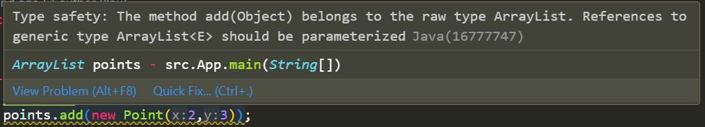
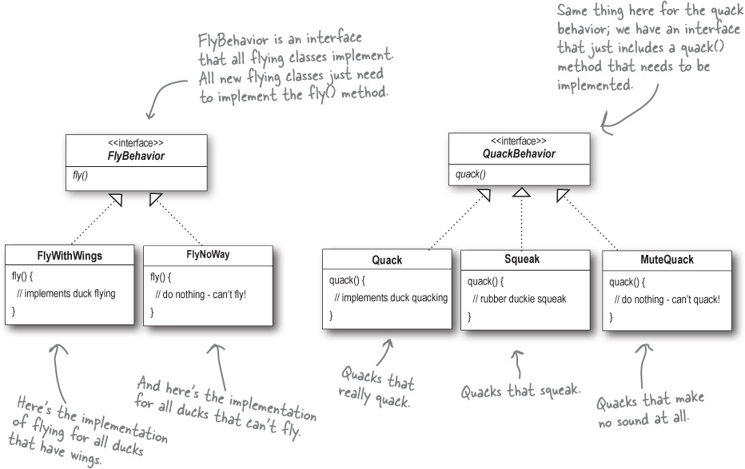
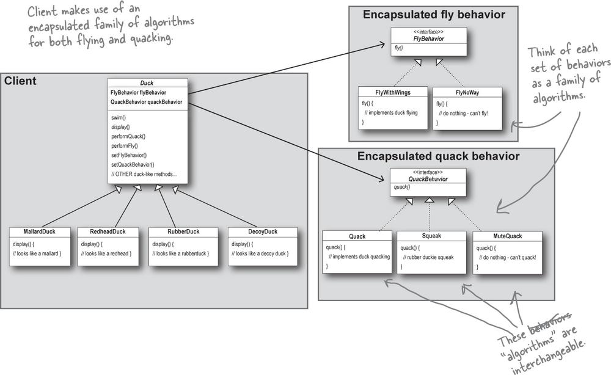
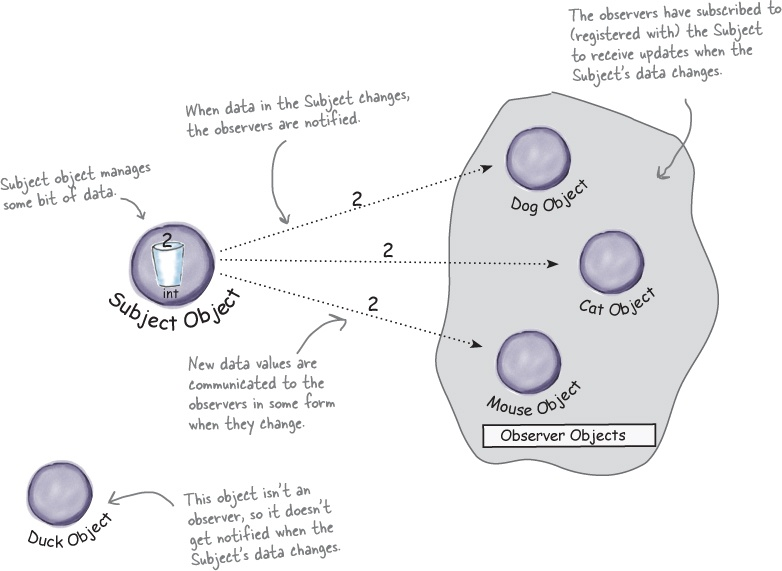
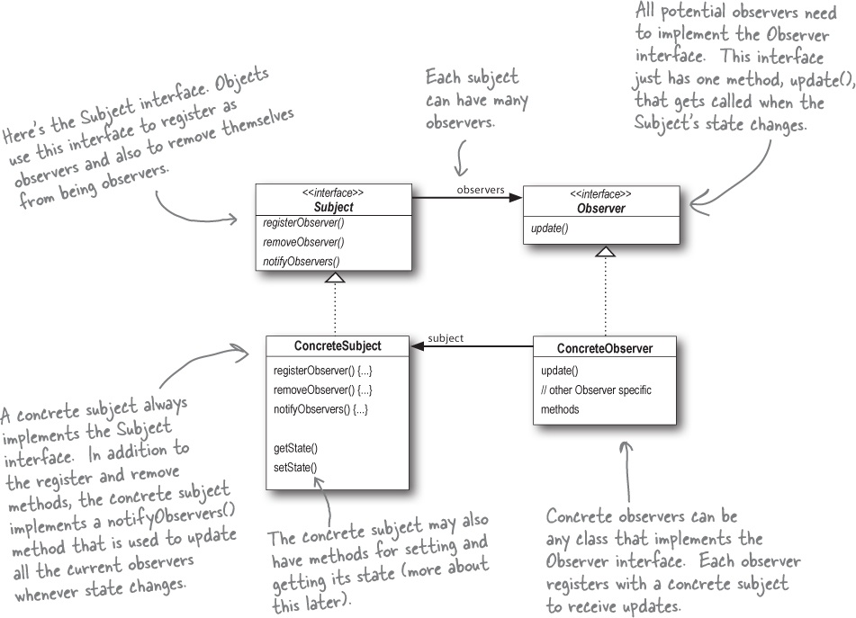

ctrl+shift+P for commmand palette
git: stash to stash changes from last commit (note it has to be in the same directory as the .git hidden files folder)
git: pop stash to return changes and remove from stash
stashes do not save changes to new/removed files?
yippee

# week 2
- if you print an object with no definition it will print the classname@hexnumber
- classes are things you make objects from
- java.lang.Object is also a class - Object() class constructs a new Object, has a bunch of methods on it. every object in Java is an instance of a class, and every class derives from the java.lang.Object class. therefore every method in java has the toString() method etc. as such, any object can be printed to console. default behaviour of toString() is class@hash.
- if you want to change the behaviour of an inherent method e.g. toString(), you should use the @Override thing to tell it we want to override it.
- the @Override method tells the compiler "i'm definitely changing the behaviour of an existing method" like a safety feature, just in case we mistype tostring() etc.
```
@Override
public String toString(){
    return "foo";
}
```

- constructors: only have to write the word once `Point3D(int x, int y, int z)`
- `this.x` refers to the attribute of the object, rather than the parameter of the constructor. though it could be smelly. maybe better to just use different parameter names.
- avoid repeating yourself
```
Point3D(int in){
    //x = in;
    //y = in;
    //z = in; 
    this(in, in, in);
}
```

- static variables are attributes that belong to a class. any object of that class will have the class's static variable, even if the object isn't instatiated. so even if you set a `static int w` to something for p4, it will also change it for p5.

 
- public is the default behaviour for everything in Java. so even if you write nothing in front of it, it will be public.
- if you change an attribute to private, then you won't be able to access it from outside the object/class itself, i.e. you need to use a method to modify that attribute. e.g. `Point3D.w = 27;` won't work anymore. making it private an only accessible using methods means that if we decide to change something like the data type (int to double), we only have to amend the method, rather than edit every single time we mention the attribute.

prac:
Canvas extends JPanel so has the paint(Graphics g) method. create a blank grid (which the constructor then makes an arraylist of cells) and call the grid's paint method. that takes each cell in the list and tells it to paint itself at its position.
getmousposition from canvas. returns a point2D (x,y). pass it all the way down to the cell when it's drawn, and check, is that point's position within the bounds of the cell? if so, then colour it.

# week 3 - class inheritance
- will always get the variable from the most local scope (if same name)
- instance scope, use `this` keyword
- `super` gets the inheritance scope
- dynamic binding - OOP languages make decisions of which methods to run at runtime if inheritance is involved (e.g. cat breathe() or mammal breathe())
- okay to call a method on a class's parent (e.g. mammal1.eat() but not animal1.breathe())
- @Override helps to say we are overriding an existing method on the parent class, to avoid typos and doubled methods
- can pass a reference variable and assign it to a variable of a higher type e.g. `Animal creature = new Cat();`
- however, cannot do the other way. but can typecast: `simon = (Cat) creature;` treat this thing as a subclass but only if it is this subclass
```
Animal creature;
Cat simon = new Cat();
creature = simon;
simon = (Cat) creature;
simon.eat();
```
- don't repeat yourself - avoid pulling code from the superclass...
- interfaces are another kind of inheritance - a way of listing behaviours/methods.
- i.e. methods (breathe, eat), not attributes (weight, age)
- e.g. `class Automobile implements Driveable` 
- if we create 2 classes that both implement the Driveable interface, we have a way of describing sets of behaviours thta apply tomultiple classes.
- only available through interfaces??
```
public interface Driveable {
    boolean startEngine();
    void stopEngine();
    float accelerate(float acc);
}
```
- by implementing an interface we are telling the complier to check these things are in the class and are the same types?
- calling the method of a Driveable d = automobile will call the method of the class.
- you can implement multiple interfaces in one class `class Automobile implements Driveable, Parkable` - need to have all th emethods defined in the Driveable interface defined in the class, plus the methods in the Parkable interface. must implement all methods to use that interface, but still okay to have extra methods unique to the class.
- no method body in interface method declaration
- can have inheritance as well as implement interfaces

- can also extend an interface
```
public interface Flyable extends Driveable {
    void fly();
}
```
`class Automobile implements Flyable` - gets methods fly() as well as Driveable methods


inner classes:
- sometimes you only need a class once/for the class that it's in, rather that creating a new class fiile
- can put the definition inside another class definition
```
Class Animal {
    Class Brain {
        ...
    }
}
```
- probably avoid using inner classes if you're unclear as to if you should use one

polymorphism:
- The most common use of polymorphism in OOP occurs when a parent class (`Animal`) reference `a` is used to refer to a child class (`Deer`) object `d`. 
- compile-time polymorphism - static polymorphism, multiple methods with the same name but different parameters - method overloading
- runtime polymorphism - dynamic method dispatch, implemented by method overriding
- An overridden method is essentially hidden in the parent class, and is not invoked unless the child class uses the super keyword within the overriding method.
- virtual method invocation - if a subclass has the same method defined as a parent method, and we say `Employee e = new Salaryman();` and call `e.getSalary();`, it will call `getSalary()` for the Employee class at compile time, but then at run time the JVM will run it for the Salaryman class. therefore, an overridden method is always invoked at runtime, no matter the data type of the reference

# week 4
ArrayLists:
- take Objects/wrapper classes, not types (Integer not int, Character not char) for every primitive type there is a wrapper class for it. except for arrays - ArrayLists
- in Java, String is a primitive type, but like a built in arraylist of chars
Generics:
- a class that takes another class as an argument e.g. `Class ArrayList<E>`
- class and method definitions that include parameters for types - allows to write code that applies to any class
- e.g. define a class for a list of items of type T, where T is a type parameter. then can pass a String class as type T, or an Integer class etc
- when inheriting a class, the new class takes attribute, constructors, and methods.
- if we have a class that is purely only to be inherited and built upon, never used by itself - e.g. generic Mammal, we can have specialised versions of it (Cat, Dog) but prevent from making an instance of the generic type. called an abstract class. `public abstract class MyClass`
- `Class AbstractCollection<E>` 
- a queue is a collection where there is ordering involved - set has no order - different kinds of collections.

- boxing and unboxing - automatically converitng between primitive and wrapper types ( constuctor parameters)
- to make generic, go to class definition and modify to take type variables. variables in place where we would typcially put types.
- `public class Pair <T, P>` (convention is single letters i.e. `<E>`) - the identifier E between the angle brackets is a type variable. indicates that the class Pair is generic and requires a Java type as an arguent to make it complete. the type variable may be used to declare instance variables, arguments to methods, the return type of methods. this avoids overloading methods like `public void add (String s)` where an arbitrary `Object` type can still be accepted by the class.
```
public class List< E > {
    ...
    public void add( E element ) {...}
    public E get( int i ) {...}
}
```
- note static methods cannot use the type variable
- now we can complete the `List` type by supplying any type parameter - called "instantiating the type" or "invoking the type"
`List<Date> dates;`
`List<java.math.BigDecimal> decimals;`
`List<Foo> foos;` etc

- everything in the system is an object - the angle brackets just add a constraint to the compilation process - once the type check is happy, the compiler is happy and forgets about it, so generates the same byte code in the end. thus, the following lines achieve essentially the same thing.
- "erasure" - since everything we do with generics applies statically at compile-time, generic info does not need to be carried over into the compiled classes. the generic nature of the classes enforced by the compiler can be "erased" in the compiled classes, allowing us to maintain compatibility with nongeneric code. Java runtime does not know anything about generics at all, although the compiler retains generic informations.
- generics are erased by the compiler for backwards compatibility.
- all the generic safety checking was done at compile time, so at runtime we cannot tell the difference between one incarnation of List and another. we are dealing with a single List type. List is the "raw type" of the generic class e.g. `List<Date>` and `List<String>` share the Java class List, with the type variables replaced with a general Java type like Object.
- how does the combination of static typing and erasure reduce the amount of polymorphism available in Java? the raw type of a generic class can be used to bypass the static type checks we would expect. at run time there is no way to get the checks back, because all the necessary type information has been erased.
```
ArrayList<Pair> p = new ArrayList<Pair>();
ArrayList q = new ArrayList();
```
- generic type inference - the compiler is smart enough to infer the type of the initialising expression from the type of the variable we are assigning to it, helps shorthand the right side of variable declarations by leaving out the contents of the `<>`
- `List` is an Interface, of which ArrayList implements. i.e. ArrayList implements the methods of the List Interface (add, remove, etc), which Sets, Queues, etc also have.
- if we decide we want to use a linked list instead of arraylist, rather than changing every line, we can use the List interface and just change the instantiation: `List x = new ArrayList();` -> `List x = new LinkedList();`
- however, we can place limitations or bounds on the parameter types, and the compiler can be more restrictive about the erasure of the type. can make something implement something from a class or below, or use an interface - but in Java, you use "extends" no matter whether it is an interface or superclass...? `public class List< E extends Date>` - the element type E must be a subtype of the `Date` type. therefore the method `public void addElement( Date element )` is therefore more restrictive than `Object` and the compiler uses `Date`. `Date` is called the "upper bound" of this type, meaning it is at the top of the object hierarchy here and the type can only be instantiated on type `Date` or on lower/more derived types.


- inheritance applies only to the "base" generic type, and not to the parameter types. assignability applies only when the two generic types are instantiated on exactly the same parameter type.
- e.g., recallling that a `List` is a type of `Collection`, we can assign instantiations of List to instantiations of Collection when the type parameter is EXACTLY the same:
```
Collection<Date> cd;
List<Date> ld = new ArrayList<Date>();
cd = ld; // Ok!
```
but:
```
List<Object> lo;
List<Date> ld = new ArrayList<Date>();
lo = ld; // Compile-time Error! Incompatible types.
```
- must be EXACTLY the same, so even trying to put `List<Integer>` into `Collection<Number>` will not work. inheritance does not follow parameter types.

generic methods:
- you can define a generic method that has its own type parameter that is not the type parameter of any class. this generic method can be a member of an ordinary class or some generic class with some other type parameter.
- e.g. even if a class has no type parameters, its methods can have a type parameter in angular brackets placed after the modifiers and before the return type.
`public <T> T getMidpoint(T[] a){...}`
- when invoking a method like this, preface the method name with the type to be plugged in, given in angular brackets: `String midString = MyClass.<String>getMidpoint(b);`
- can have different type parameters for the entire class (defined in the class definition) or for only the method (in method definition)

Practical:
- create a List of actors rather than ArrayList, in case in the the future we want to change it to a collection or set etc.

# week 5 - exceptions
excption handking in a try/catch block:
- code that might produce an error in the try block
- if somethong goes wrong, do the catch block
different kinds of exceptions:
- exceptions are basically classes, with inheritance
- error is unrecoverable e.g. out of resources
- runtime exceptions - unchecked, the program can still compile - things like arithmetic, array out of bounds. 
- exceptions we can check for like IOexceptions, user defined exceptions - compile time
- java.lang.ArithmeticException is the class pathhhhh
- throwable flags to the ocmpiler that this block of code could generate an exception. everything that calls taht code, has to have a try/catch block to handle that possibility. now things like an ertihmatic exception are now going to be handled at compile time rather than runtime
- `finally` block - even if there is an error or not, do this. happens before the try block throws an error. try block executes all the way up to the error line, then catch block if there, then finally block, then error message
```
public static int m1() {
    try {
        System.out.println("other things");
        int x = 9;
        int y = 0;
        return (x/y);
    }
    catch (Exception e) {
        System.out.println("error happened");
    }
    finally {
        System.out.println("finally happens first");
    }
    return 0;
}
```
output:
```
other things
error happened
finally happens first
made it
```
- any statement in the try block can assume that all previous statements in the block succeeded. If an earlier statement fails, execution jumps immediately to the catch clause; later statements are never executed.
- if you use the or | for types of exceptions, e will be the nearest common ancestor of the two types
- `throws Exception` just says "this block of code might thrown an exception"
- can throw all the way up the stack chain until it is handled by the first try/catch handler
- if assigning/initialising a variabel inside a try statement and we want to use it outside of the block, can transfer control out of the catch statement back to the method:
```
try {
    foo = getResults();
}
catch ( Exception e ) {
    ...
    return;
}

int bar = foo;  // Okay because we get here only
                // if previous assignment succeeds
```

# week 6 - design patterns
Strategy Pattern:


Design principle: Identify the aspects of your application that vary and separate them from what stays the same.
- __take the parts that vary and encapsulate them, so that later you can alter or extend the parts/code that vary without affecting those that don't.__
- i.e. if there's a prt of the code that is changing often, then you have a behaviour that needs to be pulled out and separated from all the stuff that doesn't change.
- all patterns provide a way to let some part of a system vary independently of all other parts

- if we know that fly() and quack() are the parts of the Duck class that vary across ducks, we will separate them by pulling them out of the Duck class and creating a new set of classes to represent each behaviour.
- we want to _assign_ behaviours to the instances of Duck. we want to be able to change the behaviour of a duck dynamically - include behaviour setter methods in the Duck classes so that we can _change_ the MallardDuck's flying behaviour _at runtime_

Design principle: Program to an interface, not an implementation.
- the Duck behaviours will live in a separate class - a class that implements a particular behaviour interface. that way, the Duck classes won't need to know any of the implementation details for their own behaviours.
- use an interface to represent each behaviour (e.g. FlyBehaviour) and each implementation of a _behaviour_ will implement one of those interfaces
- this behaviour class, rather than the duck class, will implement the behaviour interface
- e.g. FlyBehaviour interface has a method fly(), and there are behaviour classes FlyWithWings and FlyNoWay which each implement (define the behaviour) the fly() method in different ways.



Integrating the Duck Behaviour:
__the key is that a Duck will now _delegate_ its flying and quacking behaviour, instead of using quacking and flying methods defined in the Duck class/subclass.__
- add instance variables to the Duck class called flyBehaviour and quackBehaviour that are declared as the interface type (not a concrete class implementation type)
- so all duck subclasses inherit these variables
- each duck object will set these variables polymorphically to represent the specific behaviour type it would like at runtime (e.g. Squeak, etc)
- delegate to the behaviour class by replacing the old fly() method in the Duck class with performFly(). implement performFly() 
- in the subclasses, set the instance variables flyBehaviour in the constructor


Encapsulated Behaviours:
- ducks extend Duck, fly behaviours implement FlyBehaviour
- instead of thinking of the duck behaviours as a set of behaviours, think of them as a family of algorithms
- pay attention to the relationships between classes - _IS-A, HAS-A, IMPLEMENTS_
- MallardDuck is a duck. Duck has a FlyBehaviour and a QuackBehaviour. FlyWithWings implements FlyBehaviour.

- each duck _HAS-A_ FlyBehaviour to which it delegates flying - when you put two classes together like this you use __composition__. instead of inheriting their behaviour, the ducks get their behaviour by being composed with the right behaviour object.

Third design principle: favour composition over inheritance.


Observer Pattern:
- e.g. with a newspaper subscription, we can subscribe and unsubscribe ourselves without affecting the fact that the publisher will keep sending newspapers so long as it remains in business. the publisher is the __subject__ and the subscribers the __observers__ in the Observer Pattern
- when data in the Subject changes, the observers are notified.
- new data values are communicated to the observers in some form when they change.
- the observer objects have subscribed to (registered with) the Subject to receive updates when the Subject's data changes.
- the observer pattern defines a __one-to-many__ dependency between a set of objects so that when one object chanegs state, all of its dependents are notified and updated automatically.


- the subject is the sole owner and controller of the data state. the observers use the state, even if they don't own it, and are dependent on the subject to update them when the data changes. cleaner OO design than allowing many objects to control the same data.
- the thing doing the subscribing (i.e. the ConcreteSubject, or Pair) has to implement the Subject interface (i.e. Shoutable).
- by subscribing more than one object to the Subject, all of the observer objects will become informed as a side effect of one call into a method on the Subject (e.g. getFirst())

Loosely coupling:
- loosely coupled objects can interact with each other, but have little knowledge of each other - subjects and observers are loosely coupled.
- the only thing the subject knows about an observer is that it implements a certain interface (the Observer interface).
- we can add new observers at any time, since the subject depends only on a list of objects that implement the Observer interface (subscriber list)
- we never need to modify the subject to add new types of observers. if we have an new concrete class that needs to be an observer, we jus thave it implement the Observer interface and register as an observer.
- we can reuse subjects or observers independently of each other
- changes to either the subject or an observer will not affect the other
- loosely coupled designs allow us to build flexible OO systems that can handle change because they minimise the interdependency between objects.


# week 7

# week 8
Functions and methods:
- You already have the function isHidden available, so you pass it to the listFiles method using the Java 8 _method reference ::_ syntax (meaning “use this method as a value”)
- Analogous to using an object reference when you pass an object around (and object references are created by new), in Java 8 when you write `File::isHidden`, you create a method reference, which can similarly be passed around. 
```
File[] hiddenFiles = new File(".").listFiles(new FileFilter() {
    public boolean accept(File file) {
        return file.isHidden();                        
    }
});
// becomes:
File[] hiddenFiles = new File(".").listFiles(File::isHidden);
```
Lambda expressions - anonymous functions:
```
numbers.forEach( (n) -> { System.out.println(n); } );
```
- A lambda expression is a short block of code which takes in parameters and returns a value. Lambda expressions are similar to methods, but they do not need a name and they can be implemented right in the body of a method.
- normal functions, we can't usually pass in a function as a parameter (functions as first class citizens, like objects are first class). but anonymous functions we can. and also the Consumer can - an object that represents a void function that takes in one thing.
- use the `Function<T, R>` object (input T result R) as the lambda function target?
- `func.apply(c)` apply the function func to the object c
- For example, you can now write `(int x) -> x + 1` to mean “the function that, when called with argument x, returns the value x + 1.” 
- if we had a function that filters through a list of apples to sort out the green ones, and then we needed to also sort out the heavy ones, we'd be doing copy and paste.
- Java 8 makes it possible to pass the code of the condition as an argument, avoiding code duplication of the filter method. You can now write this:
```
public static boolean isGreenApple(Apple apple) {
    return GREEN.equals(apple.getColor());
}
public static boolean isHeavyApple(Apple apple) {
    return apple.getWeight() > 150;
}
public interface Predicate<T>{                                 1
    boolean test(T t);
}
static List<Apple> filterApples(List<Apple> inventory,
                                Predicate<Apple> p) {          2
    List<Apple> result = new ArrayList<>();
    for (Apple apple: inventory){
        if (p.test(apple)) {                                   3
            result.add(apple);
        }
    }
    return result;
}
```
1 Included for clarity (normally imported from java.util.function)
2 A method is passed as a Predicate parameter named p.
3 Does the apple match the condition represented by p?
- so then we can call `filterApples(inventory, Apple::isGreenApple);` or `filterApples(inventory, Apple::isHeavyApple);`
- but the anonymous functions can let us call it like this: `filterApples(inventory, (Apple a) -> GREEN.equals(a.getColor()) );` or `filterApples(inventory, (Apple a) -> a.getWeight() > 150 );`
What’s a Predicate?
The previous code passed a method Apple::isGreenApple (which takes an Apple for argument and returns a boolean) to filterApples, which expected a Predicate <Apple> parameter. The word predicate is often used in mathematics to mean something function-like that takes a value for an argument and returns true or false. As you’ll see later, Java 8 would also allow you to write Function<Apple, Boolean>—more familiar to readers who learned about functions but not predicates at school—but using Predicate<Apple> is more standard (and slightly more efficient because it avoids boxing a boolean into a Boolean).


# week 9
Streams:
- streams let you manipulate collections of data in a manipulative way -express a query, rather than code an implementation for it.
- i.e. fancy iterators over a collection of data. like how with SQL we can say SELECT name FROM dishes WHERE calorie < 400

Java 7: without streams:
```
List<Dish> lowCaloricDishes = new ArrayList<>();
for(Dish dish: menu) {
    if(dish.getCalories() < 400) {                                 1
        lowCaloricDishes.add(dish);
    }
}
Collections.sort(lowCaloricDishes, new Comparator<Dish>() {        2
    public int compare(Dish dish1, Dish dish2) {
        return Integer.compare(dish1.getCalories(), dish2.getCalories());
    }
});
List<String> lowCaloricDishesName = new ArrayList<>();
for(Dish dish: lowCaloricDishes) {
    lowCaloricDishesName.add(dish.getName());                      3
}
```
1. filters the elements using an accumulator (lowCaloricDishes is a garbage variable we use as a throwaway container, which is pushed into the library in Java 8)
2. sorts the dishes with an anonymous class
3. processes the sorted list to select the names of dishes

Java 8: with streams
```
import static java.util.Comparator.comparing;
import static java.util.stream.Collectors.toList;
List<String> lowCaloricDishesName =
               menu.stream()
                   .filter(d -> d.getCalories() < 400)       1
                   .sorted(comparing(Dish::getCalories))     2
                   .map(Dish::getName)                       3
                   .collect(toList());  
```
1. selects dishes below 400 calories
2. sorts them by calories
3. extracts the names of these dishes
4. stores all names in a List

- To exploit a multicore architecture and execute this code in parallel, you need only to change `menu.stream()` to `menu.parallelStream()`

- streams API in Java 8 lets you write code that is 
    - declarative: more concise and readable.
    - composable: greater flexibility.
    - parallelisable: better performance.
- a stream is a sequence of elements from a source that supports data-processing operations.
    - sequence of elements - provides an interface to a sequenced set of values of a specific element type, like a collection. streams are about expressing computations such as `filter`, `sorted`, and `map`, while collections are about data (storing and accessing elements).
    - source - streams consume from a data-providing source such as collections, arrays, or I/O resources. generating a stream from an ordered collection preserves the ordering.
    - data-processing operations - streams support database-like operations and common operations from functional programming languages to manipulate data e.g. filter, map, reduce, find, match, sort etc. can be executed sequentially or in parallel.
- streams have two important characteristics:
    - pipelining - many stream operations return a stream, allowing chaining of operations, enabling certain optimisations like laziness and short-circuiting. a pipeline of operations is like a database-like query on the data source.
    - internal iteration - unlike collections which are iterated explicitly, stream operations do the iteration behind the scenes.

```
import static java.util.stream.Collectors.toList;
List<String> threeHighCaloricDishNames =
  menu.stream()                                         1
      .filter(dish -> dish.getCalories() > 300)         2
      .map(Dish::getName)                               3
      .limit(3)                                         4
      .collect(toList());                               5
System.out.println(threeHighCaloricDishNames);
```
1. Gets a stream by calling the stream method on menu (the data source is the list of dishes/menu and provides a sequence of elements to the stream)
2. Creates a pipeline of data-processing operations: first filter high-calorie dishes (returns a stream)
3. Gets the names of the dishes (returns a stream)
4. Selects only the first three (returns a stream)
5. Stores the results in another List (returns a List)
6. Gives results [pork, beef, chicken]

- filter— Takes a lambda (test against a boolean function/predicate) to exclude certain elements from the stream. In this case, you select dishes that have more than 300 calories by passing the lambda d -> d.getCalories() > 300.
- map— Takes a lambda to transform an element into another one or to extract information. e.g. .map(n -> n*n) will square each item n in the stream. In this case, you extract the name for each dish by passing the method reference Dish::getName, which is equivalent to the lambda d -> d.getName().
- limit— Truncates a stream to contain no more than a given number of elements.
- collect— Converts a stream into another form. In this case you convert the stream into a list. It looks like a bit of magic; we’ll describe how collect works in more detail in chapter 6. At the moment, you can see collect as an operation that takes as an argument various recipes for accumulating the elements of a stream into a summary result. Here, toList() describes a recipe for converting a stream into a list.

- stream size with .count() - stream can only be operated upon once. conveyer belt moves objects along and counts them all. so can't call count again. it's a method, not a property like list.size()

worksheet example:
```
    // task 20
    // create a Set of Actor locations that can be filtered out
    final Set<Cell> actorLocs = new HashSet<Cell>(
      stage.actors.stream()   //create a stream from stage.actors List<Actor>
        .map(a -> a.loc)    //return a stream, after turning Actors a into their location Cells a.loc
        .collect(Collectors.toSet())    //turn that stream into a Set
    );
    // un-comment the following lines and complete them
    Stream<Cell> init = stage.grid.getRadius(from, size).stream();
    Stream<Cell> clear = 
        init.filter(loc -> !actorLocs.contains(loc));   // filter and select/keep (predicate function is the contains function) if loc/item is NOT in actorLoc
    return clear.collect(Collectors.toList());

    // remove the lines below
    // List<Cell> init = stage.grid.getRadius(from, size);
    // for(Actor a: stage.actors) {
    //   init.remove(a.loc);
    // }
    // System.out.println(init);
    // return init;
```


```
Map<Dish.Type, List<Dish>> dishesByType =
    menu.stream().collect(groupingBy(Dish::getType));
//map results may be:
{FISH=[prawns, salmon],
 OTHER=[french fries, rice, season fruit, pizza],
 MEAT=[pork, beef, chicken]}
```


# week 11/12 - Concurrency and Locking
- the thread scheduler can swap threads on and off CPU cores at any time.
- methods must be able to be swapped out while running (to avoid an infinite loop stealing the CPU). however, this risks an unpredictable/impromptu thread swap leaving a method "half done" and an object in an inconsistent state, as well as the risk of changes made in one thread not being visible in other threads when they need to be.
- objects can be locked to protect vulnerable data.

- a live system is one in which every attempted activity eventually either progresses or fails. transient failures aren't that bad (e.g. locking, waiting for input, not enough CPU time available to run thread) but permanent failures include deadlock, unrecoverable resource problem, missed signal.

Concurrent type safety: 
- if object instances remain self-consistent regardless of any other operations that may be happening at the same time.
- applies for more complex situations where other threads are potentially operating on the same objects on different CPU cores at the same time.
- one strategy for safety is to never return from a non-private method in an inconsistent statfe, and to never call any non-private method (or method on any other object) while in an inconsistent state.
- plus a way of protecting the object (like a synchronisation lock or critical section) while it's inconsistent, the system can be guaranteed to be safe.

- we want a balance of safety and liveness:
- restrict external communication of each subsystem (dadta hiding for safety).
- make internal structures of subsystems deterministic (design in static knowledge of threads and objects, even if the subsystems will interact in a concurrent, nondeterministic way).
- apply policy approaches that client apps must adhere to (but relies on cooperation and hard to debug).
- document required behaviour.

Sources of overhead:
- locks and monitors
- number of context switches
- number of threads
- scheduling
- locality of memory
- algorithm design.

e.g. different phases of an application correspond to different parts of the business process. each phase is represented by a thread pool that takes in work items one by one, does an amount of processing on each item, then hands off the item to the next thread pool. By having each thread pool focus processing on a specific functional area, we can improve throughput because we can have several items processing at once.
- the concurrent package contains thread pools for execution and queues for handing off work between pools.


## Block-structured concurrency (pre- Java 5)
`Synchronized` keyword == what's called a "critical section" in concurrency. i.e. only one thread can be progressing through any of an object's synchronized blocks/methods at once; if other threads try to enter, they're suspended by the JVM. Regardless of whether the thread is trying to enter the same or a different synchronised block on the same object.
- threads can be locked in order to ensure that only one thread at a time is using a certain resource. by telling the function to be synchronised, we ensure that only one thread is working on the value at a time.
- e.g. if there's a global variable, we don't want multiple threads writing it at the same time because then it would be uncertain.
- when a thread tries to access a blocked resource, it becomes "blocked"/locked-waiting. after the resource becomes available, the CPU picks randomly one of the locked-waiting threads to run next; thus the value/outcome is uncertain.
- the `synchronized` keyword can be applied to either a block or a method. it indicates that before entering the block/method, a thread must acquire the appropriate lock. for a method, this means acquiring the lock belonging to the object instance. for a block, the programmer should indicate which object's lock is to be acquired.
- a `static synchronized` method locks the `Class` object, because there's no instance object to lock. be careful whether you need to lock a class object explicitly, or if you need getClass(), cuz it's different with subclasses.
- after the synchronized block/method has completed, any and all changes made to the locked object are flushed back to main memory before the lock is released.
- additionally, when a synchronized block is entered, then after the lock has been acquired, any changes to the locked object are read in *from* main memory, so the thread with the lock is synchronised to main memory's view of the object before the code in the locked section begins to execute. i.e. it looks at what the main memory is immediately before executing the section.


- e.g. if we have a set values function that sets a value and then sets another value to 2* that (val=0, val2=0), when we first change that value, the state of the object becomes inconsistent. (val=2, val22=0). if we swap this "update" thread off the core in this time, and another "validate" thread comes in (check if val * 2 == val2), there will be issues? the "validate" thread can 
- the `synchronized` keyword locks this setvalues method, meaning it gets to complete fully before releasing the lock. but need to  synchronize both methods, so they require the same lock. so that while "update" thread is in progress (in inconsistent state), "validate" won't be able to look at the data until "update" is complete (ie. when the method is back in a consistent state).
- if you only synchronise the setvalues method but not the readvalues method, then the "validate" thread (check if val * 2 == val2) will read val from memory (e.g. 3), but before it can read the second value (e.g. 6), another thread could come in and start changing val (val=4), so then by the time the "validate" thread is meant to read val2, it reads the changed value instead (8).
- must make sure *all* the calls that could see/change the state of the object are synchronized.
- now the system will always be consistent.

- synchronizing the getTime() bmethod in the ThreadState class mblocks all other threads, so only one thread runs at a time.

## Fully synchronized objects
- if all conditions are met, the class is known to be thread-safe and will also be live; will be a fully-synchronized class:
- All fields are always initialized to a consistent state in every constructor. 
- There are no public fields. 
- Object instances are guaranteed to be consistent after returning from any nonprivate method (assuming the state was consistent when the method was called). 
- All methods provably terminate in bounded time. 
- All methods are synchronized. 
- There is no calling of another instance’s methods while in an inconsistent state. 
- There is no calling of any non-private method while in an inconsistent state.
- 
## Deadlocks
- e.g. You have two updates being sent to separate threads, each of which has to be confirmed on backup threads. This doesn’t seem too outlandish a design—if one thread has a failure, there is another thread that can potentially carry on. an example of a deadlock—both threads will report receiving the update, but neither will confirm receiving the update for which they’re the backup thread. bc each thread requires the other to release the lock it holds before the confirmation method can progress.
- can deal with deadlocks by always acquiring locks int he same order in every thread. rather than the first thread acquiring A then B, and second thread acquiring B then A; if both insist on acquiring A then B, then there would be no deadlock because the second thread would have been blocked from running at all until the first had completed and released its locks. (kind of like 1st completes task A while 2nd waits. then 1st throws over the key to 2nd, who can get started on task A, while 1st gets started on task B. 2nd then has to wait for 1st to pass the key for B before they can start on B).
- but with a fully synchronized object, this deadlock is prevented because the code violates the consistent state rule

## volatile keyword
a volatile field has two rules:
- the value seen by a thread is always reread from main memory before use.
- any value written by a thread is always flushed through to main memory before the instruction completes.

- like a little synchronized block around the operation, but doesn't use locks so can't deadlock.
- volatile variables should only be used to model a variable where writes to the variable don't depend on the current (read) state of the variable.

## immutable objects
- either have no state or have only `final` fields (populated in the constructors).
- are always safe and live because their state can't be changed so can never be in inconsistent state.
- values required to initialise a particular object must be passed into the constructor, which can be unwieldy. instead can use a `FactoryMethod` instead, e.g. using a static method on the class instead of a constructor to produce new objects. constructors are made protected or private so that the static FactoryMethods are the only way of instantiating.
- Builder pattern - combination of a static inner class implementing a generic builder interface, and a private constructor for the immutable class itself. Can help when you need to accumulate state from several sources before creating a new immutable object.
- final keyword only applies to the object directly pointed to. (textbook page 91) i.e. can't reassign the reference to the main object, but can reassign within the object. a final reference can point at an object that has nonfinal fields.

# week 13
in java.util.concurrent.locks there is the Lock interface which helps get around the shortcomings of the block-structured approach to locks.
- `ReentrantLock` - the equivalent of the familiar lock used in Java synchronized blocks, but more flexible. allows a thread to gain multiple locks to an object. i.e. allowing a synchronized method to call another synchronized method on the same object, letting the thread acquire the locks for both methods.
- `ReentrantReadWriteLock` - allows multiple threads to read but only one at a time to write?

- each thread locks own lock first `private final Lock lock = new ReentrantLock(); ... lock.lock();`
- using the pattern of `lock()` with a `try...finally` block, where the lock is released, is good. works well if replicating a situation similar to one where you'd have used block-structured concurrency. but if you need to pass around the Lock objects e.g. returning it from a method, can't use this patternn.

- rather than putting a thread to sleep to wait for buffer space, should put a write lock to block until there is space.


- ReentrantReadWriteLock - contains a writeLock and a readLock. 
- while a thread has the writeLock, no other threads can acquire a readLock/can read data. while there are thread(s) reading the data (has readLock), the writeLock cannot be acquired (so a thread wanting the writeLock would be blocked while waiting for all readLocks to be released.).
- `synchronized` implicitly uses a Reentrant lock. if a thread has acquired the lock on an object and is within a synchronized method, if that synchronized method calls another synchronized method on the same object, the thread will try to acquire the lock before entering that second method. since it is a re-entrant lock and the thread already has it, the thread is then allowed to enter that second method.
- if you want to use a ReentrantReadWriteLock, you have to define it explicitly.
- use try...finally blocks to ensure that even if there is an error, the lock is still released, preventing every thread from getting locked and stuck.
```
    writeLock.lock();
    try {
        value++;
    }
    finally {
        writeLock.unlock();
    }
```

- `CountDownLatch` is a synchronization pattern that allows for multiple threads to all agree on a minimum amount of prep that must be done before any thread can pass a synchronization barrier.
- provide an int value (count) when constructing a new instance. control the latch with `countDown()` - reduces the count by ` - and `await()` - tells the calling thread to wait until the count reaches 0.
```
CountDownLatch stopper = new CountDownLatch(100);
//for each 100 items
    // do something
    stopper.countDown();
stopper.await(); // tells the calling (main) thread to wait until the stopper reaches 0.
// this line will only be reached after stopper reaches 0;
```